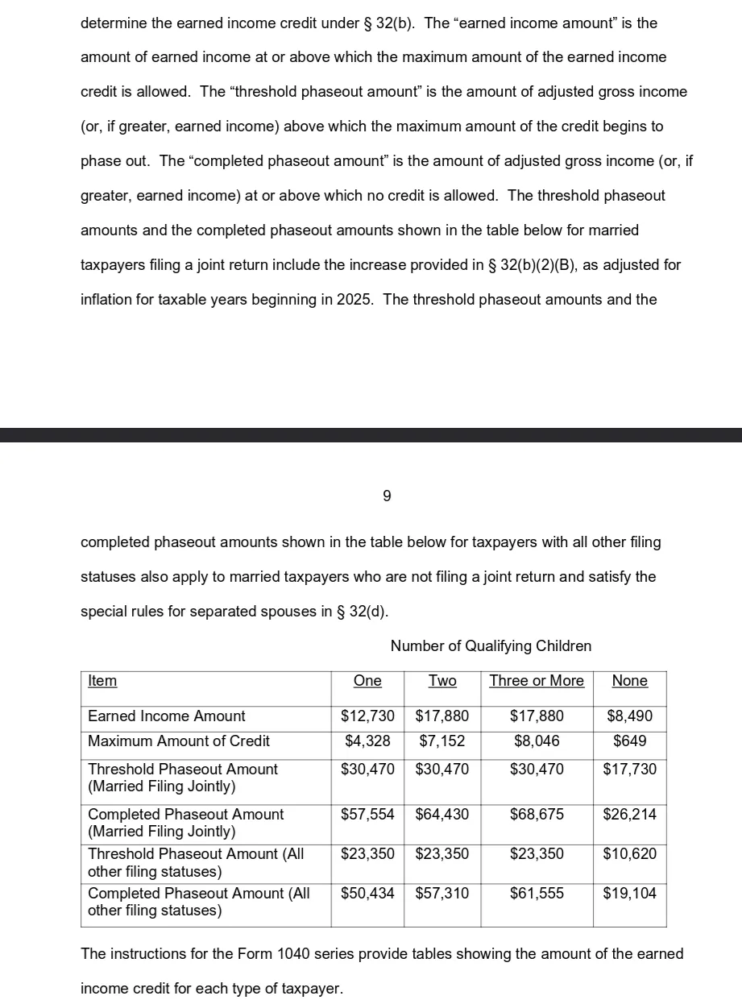

All 2025 Information.

# Sources

## Deductions
- See [here](https://www.irs.gov/pub/irs-pdf/p501.pdf) for Federal Deductions 
- See [Page 12](https://tax.vermont.gov/sites/tax/files/documents/Income-Booklet-2025.pdf) for VT standard deductions, and page 11 for personal exemptions (just the number of people times a constant). 

# Brackets
- See [here](https://www.irs.gov/filing/federal-income-tax-rates-and-brackets) for Federal Taxes brackets.
- See [here](https://www.ssa.gov/people/materials/pdfs/EN-05-10297.pdf) for FICA, which is very simple flat percentage rate for income under a dollar amount. Also see [this](https://www.irs.gov/taxtopics/tc751)
- See [here](https://tax.vermont.gov/sites/tax/files/documents/TaxRateSched-2025.pdf) for Vermont Tax Rates.

## EITC
- See [here](https://www.irs.gov/credits-deductions/individuals/earned-income-tax-credit/earned-income-and-earned-income-tax-credit-eitc-tables#eitctables)  for Federal EITC tables (the maximum). 
- See [here](https://taxpolicycenter.org/statistics/eitc-parameters) for listing of all parameters. 

- See [here](https://answerconnect.cch.com/document/jvt0109013e2c87426ae1/state/explanations/vermont/earned-income-credit) for information about Vermont Earned Income Tax Credit. The actual tax documents would not load at time of processing. 

# Logic
1. Calculate Taxes per polity:
    1. Assume and apply standard deductions from polity
        * Federal is flat amount by filing status
        * VT adds in an additional per-person exemption
    2. Loop over schedule for that polity and apply tax rates. 
        * Accumulate: Multiply the amount within the threshold by the rate
2. Calculate and Apply EITCs: 
    1. Federal Tax Credit: 
        * get earned income amount that yields max amount of credit and calculate phase in rate by dividing max_credit by that amount 
        * get phaseout amount with similar method: from phaseout start to phaseout end divided by maximum credit
        * multiple the two rates by actual amount of phase in and phase out 
        * return credits  minus debits
    2. VT EITC: just do federal * 